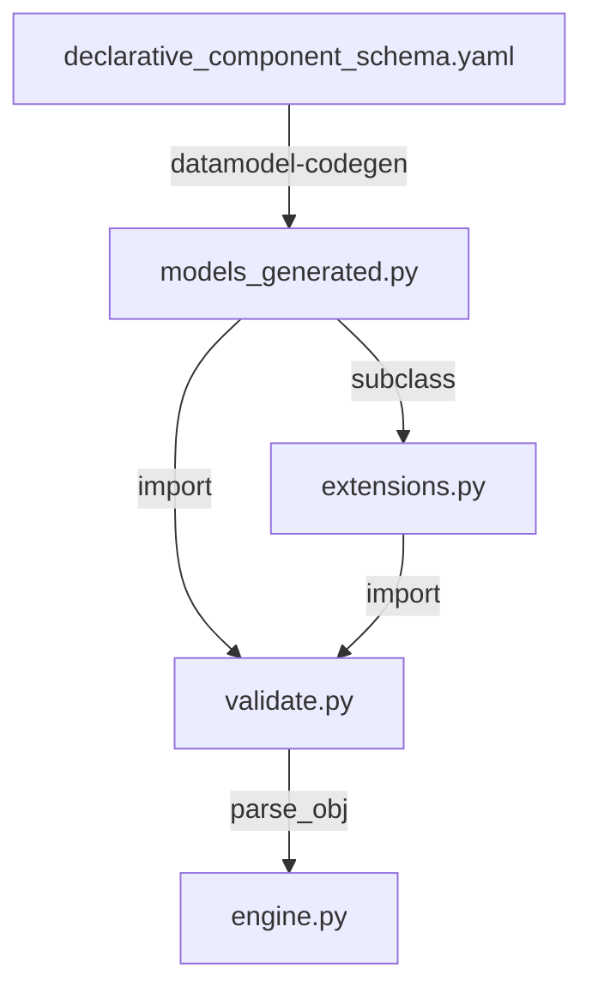
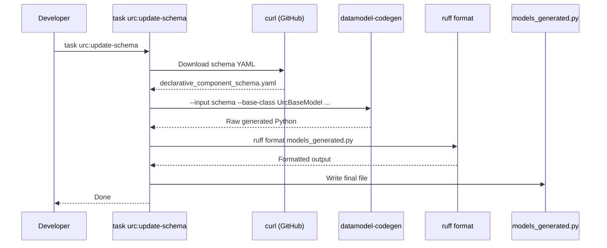
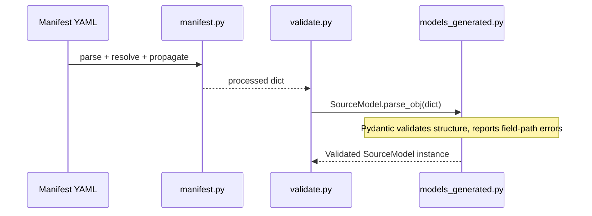

# Design: URC Model Code Generation & Pydantic Layer

## Tech Stack

- **Code generator**: `datamodel-code-generator` (latest, installed in dev venv — not shipped)
- **Runtime models**: Pydantic v1 (`pydantic<2`, pure-Python wheel)
- **Target Python**: 3.9 (Splunk's bundled interpreter)
- **Formatter**: `ruff format` (post-generation, matches project convention)
- **Task runner**: Taskfile.yml (Go Task) — new `urc:update-schema` target
- **CI**: GitHub Actions (`ci.yml`) — new staleness check job

## Directory Structure

```
ucc/urc_app/
├── schema/                                    # Dev-time (not shipped in SPL)
│   ├── declarative_component_schema.yaml      # Downloaded from Airbyte CDK
│   └── header.txt                             # Custom file header template
├── package/lib/urc/
│   ├── models_generated.py                    # Generated — DO NOT EDIT
│   ├── extensions.py                          # Hand-written subclass overrides
│   ├── validate.py                            # Validation entry point (updated import)
│   ├── manifest.py                            # Manifest processing (unchanged)
│   ├── engine.py                              # Collection engine (unchanged)
│   ├── registry.py                            # Component registry (unchanged)
│   └── components/                            # Runtime components (unchanged)
```

## Architecture Overview



## Module Design

### Module 1: `models_generated.py` — Generated Models

**Purpose**: Auto-generated Pydantic models from the Airbyte declarative schema. Never hand-edited.

**Interface**: 136 model classes inheriting from `BaseModel` with `extra = Extra.allow`, multi-value `Enum` classes, `Literal` discriminator fields.

**Generated by this exact command** (canonical, lives in Taskfile):
```bash
datamodel-codegen \
  --input ucc/urc_app/schema/declarative_component_schema.yaml \
  --output ucc/urc_app/package/lib/urc/models_generated.py \
  --input-file-type jsonschema \
  --output-model-type pydantic.BaseModel \
  --target-python-version 3.9 \
  --enum-field-as-literal all \
  --use-schema-description \
  --field-constraints \
  --use-unique-items-as-set \
  --disable-timestamp \
  --custom-file-header-path ucc/urc_app/schema/header.txt
```

**Key flags explained**:

| Flag | Requirement | Effect |
|------|-------------|--------|
| `--input-file-type jsonschema` | R1 | Explicit — don't rely on inference |
| `--output-model-type pydantic.BaseModel` | R3 | Targets Pydantic v1 BaseModel |
| `--target-python-version 3.9` | R3 | Matches Splunk runtime |
| `--enum-field-as-literal all` | R4 | `Literal["AddFields"]` instead of `Type3(Enum)` |
| `--use-schema-description` | R5 | Schema descriptions → class docstrings |
| `--field-constraints` | R9 | `minimum: 0` → `Field(ge=0)` |
| `--use-unique-items-as-set` | R9 | `uniqueItems: true` → `Set[...]` |
| `--disable-timestamp` | R6 | No timestamp in header — clean diffs |
| `--custom-file-header-path` | R7 | DO NOT EDIT warning + regeneration instructions |

**Flags intentionally NOT used** (with rationale):

| Flag | Why not |
|------|---------|
| `--use-annotated` | Pydantic v1 doesn't support `Annotated[X, Field(...)]` |
| `--use-standard-collections` | `list`/`dict` lowercase requires 3.9+ with `from __future__ import annotations` — already present, but keeping `List`/`Dict` avoids subtle v1 edge cases |
| `--use-union-operator` | Requires Python 3.10+ |
| `--snake-case-field` | Schema already uses snake_case |
| `--reuse-model` | Single schema file; no cross-file duplication |
| `--module-split-mode` | Single file is appropriate for 136 models |
| `--force-optional` | Schema required fields match actual manifest data |
| `--strip-default-none` | Cosmetic; low value for generated code |
| `--allow-extra-fields` | Already set per-class via `Config: extra = Extra.allow` in generated output |
| `--base-class` | No shared base class needed — models are inert validation gates, not runtime objects. Debug/tracing belongs in the component layer |
| `--enable-faux-immutability` | Models are value objects conceptually but need mutability for `$parameters` propagation |
| `--class-name-prefix/suffix` | Model names are already descriptive; `_generated.py` suffix on filename is sufficient |
| `--formatters` | Post-generation `ruff format` is more reliable and matches project convention |

### Module 2: `header.txt` — Custom File Header

**Purpose**: Template for the generated file header.

**Content**:
```
# AUTO-GENERATED — DO NOT EDIT
# Source: ucc/urc_app/schema/declarative_component_schema.yaml
# Regenerate: task urc:update-schema
# Generator: datamodel-code-generator
```

### Module 3: `extensions.py` — Model Subclass Overrides

**Purpose**: Hand-written file for adding validators, computed properties, or behavioral overrides to generated models. Provides the documented extension pattern.

**Interface**:
```python
"""URC model extensions — subclass overrides for generated models.

Add validators, computed properties, or behavioral overrides here.
Never edit models_generated.py directly — it will be overwritten.

Usage:
    # Import the extended model instead of the generated one:
    from urc.extensions import DeclarativeSourceExt as SourceModel

    # Or if no extension exists, import generated directly:
    from urc.models_generated import DeclarativeStream
"""

from urc.models_generated import DeclarativeSource1

# Example: add a validator or property to a generated model
# class DeclarativeSourceExt(DeclarativeSource1):
#     @validator("streams", pre=True)
#     def validate_streams_not_empty(cls, v):
#         if not v:
#             raise ValueError("At least one stream is required")
#         return v
```

**Design decision**: Start with a mostly-empty file with documented examples. Don't over-engineer until real extension needs arise. The file's existence establishes the pattern.

### Module 4: `validate.py` — Updated Import

**Purpose**: Only change is the import path: `models` → `models_generated`.

**Change**:
```python
# Before:
from urc.models import DeclarativeSource1 as SourceModel

# After:
from urc.models_generated import DeclarativeSource1 as SourceModel
```

And in `validate_stream()`:
```python
# Before:
from urc.models import DeclarativeStream

# After:
from urc.models_generated import DeclarativeStream
```

### Module 5: Taskfile target — `urc:update-schema`

**Purpose**: Single command for schema download + codegen + format.

**Implementation** (added to `Taskfile.yml` under UCC section):
```yaml
urc:update-schema:
  deps: [__ucc:resolve]
  cmds:
    - |
      . .task/ucc-env
      SCHEMA_URL="https://raw.githubusercontent.com/airbytehq/airbyte-python-cdk/main/airbyte_cdk/sources/declarative/declarative_component_schema.yaml"
      SCHEMA_FILE="${UCC_PATH}/schema/declarative_component_schema.yaml"
      OUTPUT_FILE="${UCC_PATH}/package/lib/urc/models_generated.py"
      HEADER_FILE="${UCC_PATH}/schema/header.txt"

      echo "Downloading schema from Airbyte CDK..."
      curl -fsSL "${SCHEMA_URL}" -o "${SCHEMA_FILE}"

      echo "Generating Pydantic models..."
      datamodel-codegen \
        --input "${SCHEMA_FILE}" \
        --output "${OUTPUT_FILE}" \
        --input-file-type jsonschema \
        --output-model-type pydantic.BaseModel \
        --target-python-version 3.9 \
        --enum-field-as-literal all \
        --use-schema-description \
        --field-constraints \
        --use-unique-items-as-set \
        --disable-timestamp \
        --custom-file-header-path "${HEADER_FILE}"

      echo "Formatting with ruff..."
      ruff format "${OUTPUT_FILE}" 2>/dev/null || true

      echo "Done. Generated: ${OUTPUT_FILE}"
  desc: Download Airbyte schema + regenerate Pydantic models
```

### Module 6: CI staleness check — `ci.yml` addition

**Purpose**: New job in GitHub Actions that validates generated models match the schema.

**Implementation** (added to `.github/workflows/ci.yml`):
```yaml
codegen-check:
  runs-on: ubuntu-latest
  steps:
    - name: Checkout
      uses: actions/checkout@v4

    - name: Set up Python
      uses: actions/setup-python@v5
      with:
        python-version: '3.9'

    - name: Install codegen tools
      run: |
        pip install 'datamodel-code-generator[http]' 'pydantic<2' ruff

    - name: Check generated models are up to date
      run: |
        SCHEMA="ucc/urc_app/schema/declarative_component_schema.yaml"
        OUTPUT="ucc/urc_app/package/lib/urc/models_generated.py"
        HEADER="ucc/urc_app/schema/header.txt"

        if [ ! -f "$SCHEMA" ]; then
          echo "Schema file not found — skipping codegen check"
          exit 0
        fi

        datamodel-codegen \
          --input "$SCHEMA" \
          --output /tmp/models_check.py \
          --input-file-type jsonschema \
          --output-model-type pydantic.BaseModel \
          --target-python-version 3.9 \
          --base-class urc.base.UrcBaseModel \
          --enum-field-as-literal all \
          --use-schema-description \
          --field-constraints \
          --use-unique-items-as-set \
          --disable-timestamp \
          --custom-file-header-path "$HEADER"

        ruff format /tmp/models_check.py 2>/dev/null || true

        if ! diff -q "$OUTPUT" /tmp/models_check.py > /dev/null 2>&1; then
          echo "::error::Generated models are out of sync with schema. Run: task urc:update-schema"
          diff --unified "$OUTPUT" /tmp/models_check.py | head -50
          exit 1
        fi
        echo "Generated models are up to date."
```

**Design decision**: Generate to a temp file and diff rather than using `--check` (which is not well-supported in all `datamodel-codegen` versions). This also validates the ruff formatting step.

## Data Flow





## Error Handling Strategy

- **Codegen failure** (bad schema, missing tool): Taskfile command fails with non-zero exit, prints error. No partial file written (codegen is atomic).
- **CI diff failure**: Prints first 50 lines of diff + GitHub Actions `::error::` annotation. Developer runs `task urc:update-schema` to fix.
- **Validation errors**: Unchanged — `ManifestValidationError` with field-path details.

## Testing Strategy

- **E2E tests**: Existing `test_manifests.py` validates all real manifests still pass after regeneration
- **Regression**: CI staleness check prevents drift
- **Test command**: `cd ucc/urc_app && python -m pytest tests/`
- **Lint command**: `ruff check ucc/urc_app/package/lib/urc/`

## Constraints

1. **Pydantic v1 only**: No v2 APIs (`model_post_init`, `model_validator`, `ConfigDict`). Must use `class Config`, `@validator`.
2. **No new runtime deps**: Generated models use only `pydantic` + `typing`.
3. **Codegen environment**: `datamodel-codegen` must be run with `pydantic<2` installed. The Taskfile/CI installs this explicitly.
4. **Filename change**: `models.py` → `models_generated.py` requires updating 2 import sites (`validate.py` lines 7 and 61).

## Correctness Properties

### Property 1: Regeneration Idempotency
- **Statement**: *For any* unchanged schema, when `task urc:update-schema` is run twice, then the output file SHALL be byte-identical.
- **Validates**: Requirement 7 (noise-free diffs)
- **Example**: Run codegen twice → `diff` shows no differences
- **Test approach**: Script that runs codegen twice, asserts `sha256sum` is identical

### Property 2: No TypeN Enums
- **Statement**: *For any* generated file, when searched for `class Type\d+\(Enum\)`, then zero matches SHALL be found.
- **Validates**: Requirement 4.1, 4.2
- **Example**: `grep -c 'class Type[0-9]' models_generated.py` returns 0
- **Test approach**: Regex grep on generated file

### Property 3: Backward Compatibility
- **Statement**: *For any* existing test manifest YAML, when validated against the new models, then validation SHALL succeed with the same result as the old models.
- **Validates**: NF-3
- **Example**: All manifests in `tests/manifests/` pass `validate_manifest()` unchanged
- **Test approach**: Run existing `test_manifests.py` suite — zero changes to test code

## Decisions

### Decision: `models_generated.py` vs `generated/models.py` directory
**Context:** Need to distinguish generated from hand-written code (Req 9).
**Options:**
1. Rename to `models_generated.py` — simple, 2 import sites to update
2. Move to `generated/models.py` subdirectory — more isolation, more import path changes
**Decision:** Option 1 — `models_generated.py`
**Rationale:** Minimal change. Only 2 files import from the models. A subdirectory adds `__init__.py` ceremony for no benefit.

### Decision: Temp file + diff vs `--check` for CI
**Context:** Need CI to detect stale generated models (Req 2).
**Options:**
1. `datamodel-codegen --check` — built-in, but version-dependent behavior
2. Generate to `/tmp/`, diff against committed file — portable, also validates formatting
**Decision:** Option 2 — temp file + diff
**Rationale:** More reliable across codegen versions. Also validates the ruff formatting step is applied. Shows actual diff in CI output for debugging.

### Decision: No base class — debug/tracing belongs in the component layer
**Context:** An earlier draft proposed a `UrcBaseModel` base class with debug logging, extra-field capture, and a tracing hook.
**Options:**
1. Custom base class with `--base-class` flag — consolidates Config, adds debug hooks
2. No base class — keep generated models as plain `BaseModel` subclasses
**Decision:** Option 2 — no base class
**Rationale:** Models are inert validation gates — they validate manifest structure once, then the engine passes raw dicts to component classes. Debug logging, tracing, and error handling belong in the component layer (HttpRequester, SimpleRetriever, etc.) where the actual work happens. Those already have `logging.getLogger(__name__)`. A base class on models would log "parsed 5 fields" which Pydantic validation errors already cover better. The 38 redundant `Config` blocks are noise but harmless in generated code no one reads.
