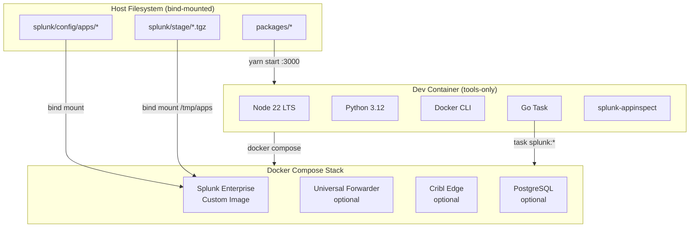
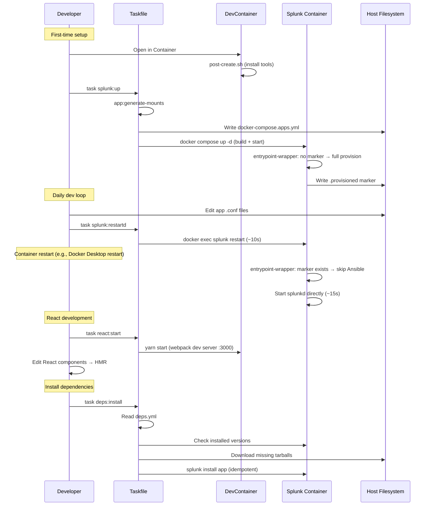
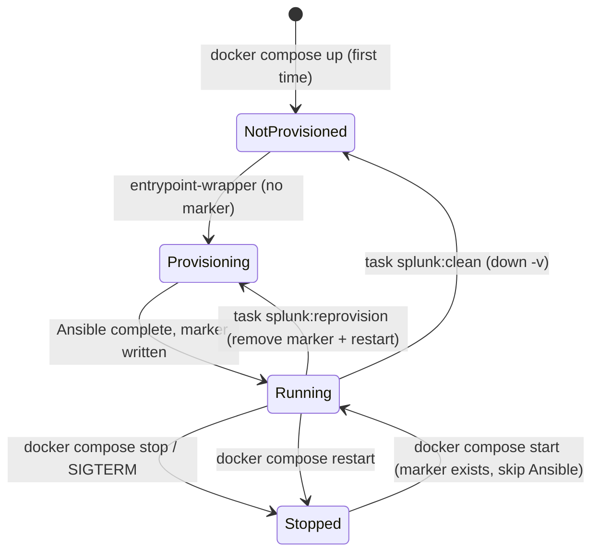

# Design: Devcontainer Modernize

## Architecture Overview



## Module Design

### Module 1: Custom Splunk Image + Entrypoint Wrapper

- **Purpose**: Wrap the official Splunk entrypoint to skip Ansible re-provisioning on restart. This is the key innovation for fast dev loops.
- **Files**: `splunk/Dockerfile`, `splunk/entrypoint-wrapper.sh`
- **How it works**:

```
entrypoint-wrapper.sh
├── Check for marker file at /opt/splunk/var/.provisioned
├── IF marker exists AND command is "start-service":
│   ├── Skip Ansible entirely
│   ├── Start splunkd directly: /opt/splunk/bin/splunk start --accept-license
│   ├── Trap SIGTERM → splunk stop
│   └── Tail splunkd_stderr.log (same as stock entrypoint)
├── ELSE (first run, or FORCE_PROVISION=true):
│   ├── Delegate to stock /sbin/entrypoint.sh
│   └── On success, write marker file
└── END
```

- **Marker file**: `/opt/splunk/var/.provisioned` — lives in the `splunk-var` named volume, so it persists across container recreations but is cleared by `docker compose down -v`.
- **Force re-provision**: Set `FORCE_PROVISION=true` env var or run `task splunk:reprovision` (which removes the marker and restarts).

**Dockerfile** (minimal):
```dockerfile
ARG SPLUNK_VERSION=9.4.0
FROM splunk/splunk:${SPLUNK_VERSION}

USER root
RUN microdnf install -y acl && microdnf clean all

COPY entrypoint-wrapper.sh /sbin/entrypoint-wrapper.sh
RUN chmod 755 /sbin/entrypoint-wrapper.sh

USER ansible
ENTRYPOINT ["/sbin/entrypoint-wrapper.sh"]
CMD ["start-service"]
```

- **Dependencies**: Official `splunk/splunk` image

### Module 2: Docker Compose Services

- **Purpose**: Define runtime services independently from the devcontainer
- **File**: `.devcontainer/docker-compose.yml`
- **Interface**: `task splunk:up`, `task splunk:down`, `task splunk:logs`, etc.
- **Key design decisions**:
  - Uses custom image (built from `splunk/Dockerfile`)
  - Bind-mounts each app directory individually into `/opt/splunk/etc/apps/`
  - Since docker-compose doesn't support glob mounts, the Taskfile generates a `.devcontainer/docker-compose.apps.yml` override file listing all app mounts
  - Named volume for `splunk-var` only (not `splunk-etc` — bind mounts handle apps)
  - Optional sidecars commented out by default

### Module 3: App Mount Generator

- **Purpose**: Dynamically generate docker-compose override with bind mounts for all apps in `splunk/config/apps/`
- **File**: Taskfile task `app:generate-mounts`
- **How it works**:
  1. Scan `splunk/config/apps/` for directories
  2. Generate `.devcontainer/docker-compose.apps.yml` with volume entries:
     ```yaml
     services:
       splunk:
         volumes:
           - ${LOCAL_WORKSPACE_FOLDER:-.}/splunk/config/apps/MyApp:/opt/splunk/etc/apps/MyApp
           - ${LOCAL_WORKSPACE_FOLDER:-.}/splunk/config/apps/splunk-config-dev:/opt/splunk/etc/apps/splunk-config-dev
     ```
  3. The main compose file includes this override via `-f` flag
  4. Runs automatically before `splunk:up`

### Module 4: Dependency Manager

- **Purpose**: Idempotent installation of Splunkbase app dependencies
- **File**: `splunk/config/deps.yml` + Taskfile tasks
- **Interface**: `task deps:install`
- **How it works**:
  1. Read `splunk/config/deps.yml`
  2. For each dependency:
     a. Check if already installed at correct version via `splunk display app`
     b. If not: download tarball (Splunkbase API or direct URL) to `splunk/stage/`
     c. Install via `splunk install app /tmp/apps/<name>.tgz -update 1`
  3. Skip already-installed apps (idempotent)
- **Dependencies**: Running Splunk container, `SPLUNKBASE_USERNAME`/`SPLUNKBASE_PASSWORD` for Splunkbase downloads

### Module 5: Devcontainer Configuration

- **Purpose**: Tools-only VS Code dev environment
- **Files**: `.devcontainer/devcontainer.json`, `.devcontainer/post-create.sh`
- **Interface**: "Reopen in Container" in VS Code
- **Key decisions**:
  - Ubuntu 24.04 base image
  - Features: docker-outside-of-docker, node 22, python 3.12, go-task
  - `post-create.sh` installs: splunk-appinspect, ruff, pytest (nothing else)
  - No `shutdownAction: stopCompose` — compose lifecycle is independent
  - Ports forwarded: 8000, 8089, 8088, 3000

### Module 6: Taskfile

- **Purpose**: Central automation for all operations
- **File**: `Taskfile.yml`
- **Namespaces**:
  - `splunk:*` — compose lifecycle (up, down, logs, status, restart, restartd, reprovision, clean, build)
  - `app:*` — app management (create, package, provision, generate-mounts)
  - `react:*` — React dev (create, start, build-install)
  - `deps:*` — dependency management (install, check)
  - `python:*` — Python tooling (lint, format, test)

## Data Flow



## State Management



## Error Handling Strategy

- **Entrypoint wrapper**: If splunkd fails to start in skip-provision mode, log the error and suggest `task splunk:reprovision`
- **Dependency install**: If a Splunkbase download fails (auth, network), log clearly and continue with remaining deps
- **App mount generation**: If `splunk/config/apps/` is empty, generate an empty override file (no error)
- **Tarball packaging**: Validate app directory exists before packaging; clear error message if not

## Property Tests

### P1: Skip-provision correctness
- **Statement**: *For any* Splunk container with a `.provisioned` marker in `splunk-var`, when the container starts with `start-service`, then Ansible is NOT executed and splunkd starts directly.
- **Validates**: R2.1, R2.2, NF2
- **Example**: `docker compose restart splunk` completes in <20s on second run
- **Test approach**: Check container logs for absence of "ansible-playbook" and presence of "Skipping Ansible provisioning"

### P2: First-run provisioning
- **Statement**: *For any* Splunk container without a `.provisioned` marker, when the container starts, then full Ansible provisioning runs and the marker is created.
- **Validates**: R2.3
- **Example**: `docker compose down -v && docker compose up` runs full provisioning
- **Test approach**: Check container logs for "ansible-playbook" execution and marker file existence

### P3: Force re-provision
- **Statement**: When `FORCE_PROVISION=true` is set or the marker file is removed, then full Ansible provisioning runs regardless of marker state.
- **Validates**: R2.4
- **Test approach**: Set env var, restart, check logs for Ansible execution

### P4: Multi-app mount generation
- **Statement**: *For any* set of directories in `splunk/config/apps/`, the generated `docker-compose.apps.yml` contains a bind mount entry for each directory.
- **Validates**: R4.5, R3.3
- **Test approach**: Create 3 app dirs, run `task app:generate-mounts`, validate YAML output

### P5: Idempotent dependency install
- **Statement**: Running `task deps:install` twice with the same `deps.yml` produces no changes on the second run.
- **Validates**: R5.2
- **Test approach**: Run install, capture output, run again, verify "already installed" messages

### P6: Devcontainer tools-only
- **Statement**: The devcontainer image contains no Splunk binaries or runtime. Splunk runs only in the compose stack.
- **Validates**: R1.2
- **Test approach**: Verify `which splunk` returns nothing inside devcontainer

### P7: App live-reload via bind mount
- **Statement**: *For any* file change in a bind-mounted app directory, the change is visible inside the Splunk container without restarting the container or re-packaging.
- **Validates**: R3.3
- **Test approach**: Write a file to `splunk/config/apps/TestApp/test.txt`, verify it exists at `/opt/splunk/etc/apps/TestApp/test.txt` inside the container

## Edge Cases

- **Empty `splunk/config/apps/`**: `app:generate-mounts` should produce a valid but empty override file
- **App directory with spaces in name**: Unlikely but should be handled in mount generation
- **Splunkbase auth failure**: `deps:install` should log the error and continue with other deps
- **Docker Desktop restart**: Container restarts trigger entrypoint-wrapper; marker should survive (it's in `splunk-var` volume)
- **Concurrent `task splunk:up` calls**: Docker compose handles this (idempotent)
- **Missing `.env` file**: Taskfile should fall back to defaults; `post-create.sh` creates it from example

## Security Considerations

- `.env` file is gitignored (contains `SPLUNK_PASSWORD`, Splunkbase creds)
- Splunk admin password defaults to `admin123` for dev — acceptable for local dev only
- No secrets baked into Docker images
- `splunk.env.example` contains placeholder values, not real credentials
