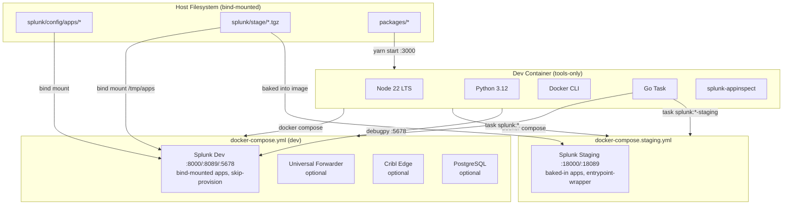
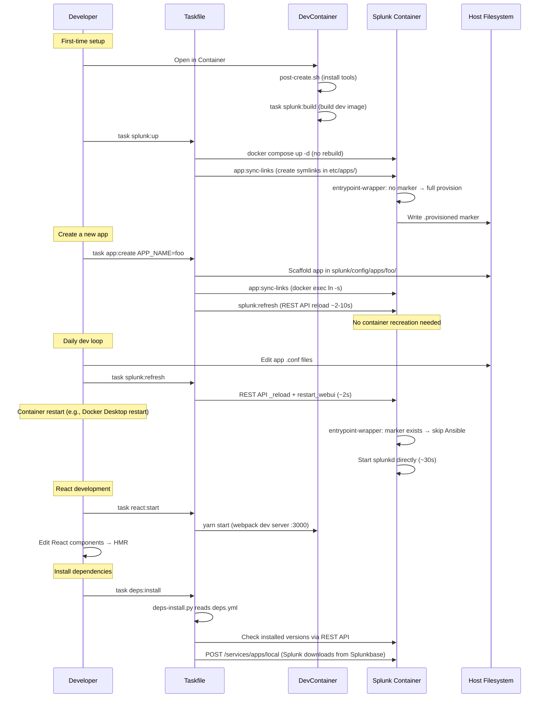
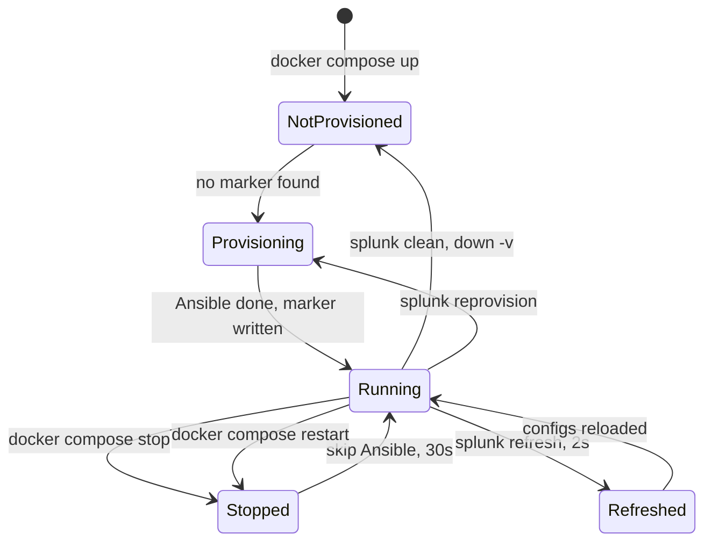

# Design: Devcontainer Modernize

## Tech Stack

- **Devcontainer**: `mcr.microsoft.com/devcontainers/base:ubuntu-24.04` + features (node 22, python 3.12, docker-outside-of-docker, go-task)
- **Splunk image**: `splunk/splunk:9.4.0` with multi-stage Dockerfile (base → dev / staging)
- **React UI**: `@splunk/create` (webpack-based), `@splunk/dashboard-core` for Dashboard Studio embedding
- **Automation**: Go Task (`Taskfile.yml`)
- **Linting**: ruff (Python), shellcheck (Bash)
- **Testing**: pytest (Python), `@devcontainers/cli` (E2E)
- **CI/CD**: GitHub Actions, `VatsalJagani/splunk-app-action@v5` (build + AppInspect)

## Directory Structure

```
.devcontainer/
  devcontainer.json              # Tools-only dev container
  docker-compose.yml             # Dev Splunk (target: dev, bind mounts, port 8000)
  docker-compose.staging.yml     # Staging Splunk (target: staging, baked apps, port 18000)
  post-create.sh                 # Tool install + Splunk image build
splunk/
  Dockerfile                     # Multi-stage: base → dev / staging
  entrypoint-wrapper.sh          # Skip-provision + auto-discover /tmp/apps/*.tgz for SPLUNK_APPS_URL
  scripts/
    deps-install.py              # Splunkbase dependency installer (stdlib Python, no deps)
  config/
    apps/                        # Splunk app source directories (bind-mounted to /opt/splunk/dev-apps/, symlinked into etc/apps/)
      splunk-config-dev/         # Dev-mode web.conf (js_no_cache, enableWebDebug, etc.)
      <your_app>/                  # Created via `task app:create APP_NAME=<your_app>`
    deps.yml                     # Splunkbase dependencies (MLTK, SA-VSCode, etc.)
  stage/                         # Built tarballs (.tgz) — gitignored, .gitkeep tracked
packages/                        # React/JS source (monorepo via @splunk/create) — .gitkeep tracked
Taskfile.yml                     # All automation
.env                             # Secrets/config — gitignored
splunk.env.example               # Template for .env
AGENTS.md                        # Concise repo summary + windloop hint
ARCHITECTURE.md                  # Full architecture, commands, debugging docs
.vscode/launch.json              # Debug configs (Python attach, Chrome, React dev server)
.ref/                            # Reference repos — gitignored
tests/e2e/                       # E2E test scripts
.github/workflows/
  ci.yml                           # Push/PR: build + local AppInspect
  release.yml                      # Tag push: build + API AppInspect + artifact upload
```

## Architecture Overview



## Module Design

### Module 1: Custom Splunk Image + Entrypoint Wrapper

- **Purpose**: Wrap the official Splunk entrypoint to skip Ansible re-provisioning on restart. This is the key innovation for fast dev loops.
- **Files**: `splunk/Dockerfile`, `splunk/entrypoint-wrapper.sh`
- **How it works**:

```
entrypoint-wrapper.sh
├── Check for marker file at /opt/splunk/var/.provisioned
├── IF marker exists AND command is "start-service":
│   ├── Skip Ansible entirely
│   ├── Start splunkd directly: /opt/splunk/bin/splunk start --accept-license
│   ├── Trap SIGTERM → splunk stop
│   └── Tail splunkd_stderr.log (same as stock entrypoint)
├── ELSE (first run, or FORCE_PROVISION=true):
│   ├── Delegate to stock /sbin/entrypoint.sh
│   └── On success, write marker file
└── END
```

- **Marker file**: `/opt/splunk/var/.provisioned` — lives in the `splunk-var` named volume, so it persists across container recreations but is cleared by `docker compose down -v`.
- **Force re-provision**: Set `FORCE_PROVISION=true` env var or run `task splunk:reprovision` (which removes the marker and restarts).

**Dockerfile** (minimal):
```dockerfile
ARG SPLUNK_VERSION=9.4.0
FROM splunk/splunk:${SPLUNK_VERSION}

USER root
RUN microdnf install -y acl && microdnf clean all

COPY entrypoint-wrapper.sh /sbin/entrypoint-wrapper.sh
RUN chmod 755 /sbin/entrypoint-wrapper.sh

USER ansible
ENTRYPOINT ["/sbin/entrypoint-wrapper.sh"]
CMD ["start-service"]
```

- **Dependencies**: Official `splunk/splunk` image

### Module 2: Docker Compose Services

- **Purpose**: Define runtime services independently from the devcontainer
- **File**: `.devcontainer/docker-compose.yml`
- **Interface**: `task splunk:up`, `task splunk:down`, `task splunk:logs`, etc.
- **Key design decisions**:
  - Uses custom image (built from `splunk/Dockerfile`)
  - Single bind mount: `splunk/config/apps/` → `/opt/splunk/dev-apps/` inside the container
  - Symlinks in `/opt/splunk/etc/apps/` point to each app under `/opt/splunk/dev-apps/` (created by `app:sync-links`)
  - Named volumes: `splunk-var` (indexed data, provisioning marker) and `splunk-etc` (Splunk config, installed apps) — both persist across container recreation for skip-provision
  - Symlinks live inside `splunk-etc` volume and persist across container restarts
  - Adding a new app requires only a new symlink (`docker exec`) + refresh — no container recreation
  - Optional sidecars commented out by default

### Module 3: App Symlink Manager

- **Purpose**: Create and maintain symlinks from `/opt/splunk/etc/apps/<app>` → `/opt/splunk/dev-apps/<app>` for each app in `splunk/config/apps/`
- **File**: Taskfile task `app:sync-links`
- **How it works**:
  1. Scan `/opt/splunk/dev-apps/` inside the running container for directories
  2. For each directory, create a symlink at `/opt/splunk/etc/apps/<app>` → `/opt/splunk/dev-apps/<app>` (skip if symlink already exists)
  3. Runs via `docker exec` — requires the Splunk container to be running
  4. Runs automatically after `splunk:up` (container start) and after `app:create`
- **Why symlinks**: Docker bind mounts are immutable after container creation. Per-app bind mounts required container recreation (~30s) for each new app. Symlinks avoid this — new apps need only `docker exec ln -s` + `splunk:refresh` (~2-10s). This pattern is validated by Splunk's own `@splunk/create` tooling (`yarn run link:app`).

### Module 4: Dependency Manager

- **Purpose**: Idempotent installation of Splunkbase app dependencies
- **Files**: `splunk/config/deps.yml`, `splunk/scripts/deps-install.py`
- **Interface**: `task deps:install`
- **How it works**:
  1. Read `splunk/config/deps.yml` (regex-based parser, no pyyaml needed)
  2. For each dependency:
     a. Check if already installed at correct version via Splunk REST API (`/services/apps/local/<name>`)
     b. For Splunkbase deps: authenticate via `api/account:login`, then POST to Splunk REST API `/services/apps/local` — Splunk downloads the app itself (same approach as splunk-ansible)
     c. For URL deps: download tarball, install via `splunk install app`
  3. Skip already-installed apps (idempotent)
- **Implementation**: Self-contained Python script (stdlib only, no external deps)
- **Dependencies**: Running Splunk container, `SPLUNKBASE_USERNAME`/`SPLUNKBASE_PASSWORD` for Splunkbase downloads

### Module 5: Devcontainer Configuration

- **Purpose**: Tools-only VS Code dev environment
- **Files**: `.devcontainer/devcontainer.json`, `.devcontainer/post-create.sh`
- **Interface**: "Reopen in Container" in VS Code
- **Key decisions**:
  - Ubuntu 24.04 base image
  - Features: docker-outside-of-docker, node 22, python 3.12, go-task
  - `post-create.sh` installs: splunk-appinspect, ruff, pytest; then builds Splunk dev image
  - No `shutdownAction: stopCompose` — compose lifecycle is independent
  - Ports forwarded: 8000, 8089, 8088, 3000

### Module 6: Taskfile

- **Purpose**: Central automation for all operations
- **File**: `Taskfile.yml`
- **Namespaces**:
  - `splunk:*` — compose lifecycle:
    - `build` / `up` / `down` / `clean` — image build is separate from container start
    - `refresh` — reload configs + static assets via REST API (no restart)
    - `restartd` — restart splunkd process (~10s)
    - `restart` — restart container (skip-provision ~30s)
    - `reprovision` — force full Ansible re-provisioning
    - `status` / `logs` — monitoring
    - `build-staging` / `up-staging` / `down-staging` / `clean-staging` / `logs-staging` — staging
  - `app:*` — app management (create, package, provision, sync-links)
    - `create` scaffolds app + `sync-links` + `refresh` (no container recreation)
  - `react:*` — React dev (create, start, build-install)
    - `create` also creates Splunk app skeleton + `sync-links` + `refresh` (no container recreation)
  - `deps:*` — dependency management (install)
  - `python:*` — Python tooling (lint, format, test)

### Module 7: Staging Compose

- **Purpose**: Self-contained staging environment running alongside dev on different ports
- **File**: `.devcontainer/docker-compose.staging.yml`
- **Interface**: `task splunk:up-staging`, `task splunk:down-staging`, `task splunk:clean-staging`, `task splunk:logs-staging`
- **Key design decisions**:
  - Targets the `staging` Dockerfile stage (bakes in tarballs from `splunk/stage/`)
  - Uses `entrypoint-wrapper.sh` (same as dev — auto-discovers `/tmp/apps/*.tgz` for `SPLUNK_APPS_URL`)
  - Separate ports: 18000 (Web), 18089 (REST), 18088 (HEC)
  - Own named volumes (`splunk-staging-var`, `splunk-staging-etc`) — fully isolated from dev
  - No bind mounts — apps are baked into the image
  - Separate container name (`splunk-staging`) — no conflicts with dev

### Module 8: Debugging Support

- **Purpose**: Enable Python and React/JS debugging from VSCode into the Splunk container
- **Files**: `.vscode/launch.json`, `splunk/config/deps.yml`, `.devcontainer/docker-compose.yml`, `splunk/config/apps/splunk-config-dev/`
- **Python debugging**:
  - SA-VSCode add-on provides `splunk_debug` module with `enable_debugging()` function
  - Developer adds debug hook to Python code → triggers debugpy listener on port 5678
  - Port 5678 exposed in dev compose → VSCode attaches via "Python: Attach to Splunk" launch config
  - Path mapping: `splunk/config/apps/` ↔ `/opt/splunk/etc/apps/`
- **React/JS debugging**:
  - Dev server mode: webpack HMR on :3000 → "Chrome: React Dev Server" launch config
  - Splunk Web mode: built app with source maps → "Chrome: Splunk Web App" launch config
  - Staging mode: staging on :18000 → "Chrome: Staging Splunk Web" launch config
- **splunk-config-dev app**: Sets `web.conf` options (`js_no_cache`, `minify_js`, `enableWebDebug`, `minify_css`) for JS debugging in Splunk Web

## Data Flow



## State Management



## Data Models

### deps.yml

```yaml
dependencies:
  - name: Splunk_SA_Scientific_Python_linux_x86_64
    splunkbase_id: 2882
    version: "4.2.3"
  - name: Splunk_ML_Toolkit
    splunkbase_id: 2890
    version: "5.6.1"
  # - name: SA-VSCode
  #   splunkbase_id: 4801
  #   version: "0.1.3"
  # - name: custom_app
  #   url: "https://example.com/custom_app-1.0.tgz"
```

## Error Handling Strategy

- **Entrypoint wrapper**: If splunkd fails to start in skip-provision mode, log the error and suggest `task splunk:reprovision`
- **Dependency install**: If a Splunkbase download fails (auth, network), log clearly and continue with remaining deps
- **App symlink sync**: If `splunk/config/apps/` is empty, `app:sync-links` is a no-op (no error). If Splunk is not running, defers to next `splunk:up`.
- **Tarball packaging**: Validate app directory exists before packaging; clear error message if not

## Testing Strategy

- **Static validation**: shellcheck, JSON syntax, `docker compose config`, `task --list`
- **Property tests**: Verify design invariants, inline with implementation tasks
- **E2E tests**: `@devcontainers/cli` build → up → exec smoke tests (tools, compose, taskfile)
- **E2E command**: `task test:e2e`
- **Lint command**: `task python:lint` (ruff)

## Constraints

- Must use the official `splunk/splunk` Docker image as the base (not a fork)
- The entrypoint wrapper must be forward-compatible with Splunk image updates
- Dockerfile is minimal: FROM official image, install acl, COPY wrapper, override ENTRYPOINT
- Compose files use the custom image (built from `splunk/Dockerfile`)
- React dev server proxy to Splunk REST API is a `@splunk/create` default, not custom config
- No Yeoman (`yo`), no `splunk-packaging-toolkit` (slim) — both are deprecated
- `@splunk/create` used via `npx`, not installed globally
- Devcontainer must NOT run Splunk inside it
- Compose services are started/stopped independently from the devcontainer lifecycle
- Ephemeral directories (`splunk/stage/`, `packages/`) are created on demand; `.gitkeep` files track them in git

## Property Tests

### P1: Skip-provision correctness
- **Statement**: *For any* Splunk container with a `.provisioned` marker in `splunk-var`, when the container starts with `start-service`, then Ansible is NOT executed and splunkd starts directly.
- **Validates**: R2.1, R2.2, NF2
- **Example**: `docker compose restart splunk` completes in <40s on second run
- **Test approach**: Check container logs for absence of "ansible-playbook" and presence of "Skipping Ansible provisioning"

### P2: First-run provisioning
- **Statement**: *For any* Splunk container without a `.provisioned` marker, when the container starts, then full Ansible provisioning runs and the marker is created.
- **Validates**: R2.2
- **Example**: `docker compose down -v && docker compose up` runs full provisioning
- **Test approach**: Check container logs for "ansible-playbook" execution and marker file existence

### P3: Force re-provision
- **Statement**: When `FORCE_PROVISION=true` is set or the marker file is removed, then full Ansible provisioning runs regardless of marker state.
- **Validates**: R2.3
- **Test approach**: Set env var, restart, check logs for Ansible execution

### P4: Multi-app symlink creation
- **Statement**: *For any* set of directories in `splunk/config/apps/`, `task app:sync-links` creates a corresponding symlink in `/opt/splunk/etc/apps/` pointing to `/opt/splunk/dev-apps/<app>`. Existing symlinks are preserved; missing ones are created.
- **Validates**: R3.2, R4.1, R4.5
- **Test approach**: Create 3 app dirs, run `task app:sync-links`, verify symlinks exist inside the container via `docker exec ls -la`

### P5: Idempotent dependency install
- **Statement**: Running `task deps:install` twice with the same `deps.yml` produces no changes on the second run.
- **Validates**: R5.1, R5.2
- **Test approach**: Run install, capture output, run again, verify "already installed" messages

### P6: Devcontainer tools-only
- **Statement**: The devcontainer image contains no Splunk binaries or runtime, uses modern config schema, and provides a fully configured dev environment. Splunk runs only in the compose stack.
- **Validates**: R1.1, R1.2, R1.3, NF4
- **Test approach**: Verify `which splunk` returns nothing inside devcontainer

### P7: App live-reload via symlinked bind mount
- **Statement**: *For any* file change in a bind-mounted app directory on the host, the change is visible inside the Splunk container at `/opt/splunk/etc/apps/<app>/` (through the symlink) without restarting the container or re-packaging.
- **Validates**: R3.2, R3.3
- **Test approach**: Write a file to `splunk/config/apps/TestApp/test.txt`, verify it exists at `/opt/splunk/etc/apps/TestApp/test.txt` inside the container (traversing the symlink)

### P8: Staging compose isolation
- **Statement**: *For any* staging container started via `docker-compose.staging.yml`, it uses different ports (18000/18089/18088), a separate volume (`splunk-staging-var`), a separate container name (`splunk-staging`), targets the `staging` Dockerfile stage, and has corresponding Taskfile commands.
- **Validates**: R3.1, R9.1, R9.2
- **Example**: `task splunk:up && task splunk:up-staging` — both containers run simultaneously without port conflicts
- **Test approach**: Validate `docker compose config` for both files; verify port mappings, volume names, container names, and build target are distinct

### P9: Debug configurations complete
- **Statement**: The dev compose file exposes port 5678 for debugpy, `launch.json` contains four configurations (Python attach, Chrome Splunk Web, Chrome React dev, Chrome Staging), and `splunk-config-dev` sets web.conf debug options.
- **Validates**: R8.1, R8.2, R8.3
- **Test approach**: Validate port 5678 in `docker compose config`; parse `launch.json` for all four configs with correct ports and path mappings

### P10: Devcontainer CLI build + up succeeds
- **Statement**: *For any* clean checkout of the repo, `devcontainer build --workspace-folder .` and `devcontainer up --workspace-folder .` complete successfully, and `post-create.sh` exits 0 within the time budget.
- **Validates**: R10.1, NF1
- **Example**: `npx @devcontainers/cli build --workspace-folder .` exits 0
- **Test approach**: Run devcontainer CLI build and up in CI or locally; assert exit codes are 0

### P11: Devcontainer tools and automation available
- **Statement**: *For any* running devcontainer, all expected tools (node, python3, docker, task, ruff) are on PATH, `task --list` succeeds showing all namespaces (splunk, app, react, deps, python, test), and `docker compose config` validates for both dev and staging compose files.
- **Validates**: R1.4, R4.2, R4.3, R4.4, R6.1, R6.2, R6.3, R7.1, R7.2, R10.1, R10.2
- **Example**: `devcontainer exec --workspace-folder . node --version` returns a version string
- **Test approach**: `devcontainer exec` each tool check; parse outputs for expected patterns

### P12: Skip-provision and reprovision E2E
- **Statement**: *For any* provisioned Splunk container, restarting it recovers in ≤60s without running Ansible. After `task splunk:reprovision`, full Ansible runs and the marker is re-created.
- **Validates**: R2.1, R2.2, R2.3, R10.5, NF2
- **Test approach**: Restart container, time recovery, check logs for absence of Ansible. Then reprovision, verify marker removed and re-created.

### P13: App naming consistency
- **Statement**: `APP_NAME` in `.env` equals the folder name under `splunk/config/apps/` and equals `[package] id` in that app's `app.conf`. For React apps, `packages/<APP_NAME>/` also exists. `[ui] label` is the human-readable form (underscores → spaces).
- **Validates**: R13.1, R13.2, R13.3
- **Test approach**: Set `APP_NAME`, run `app:create`, verify folder name, `app.conf` `[package] id`, and `[ui] label` match expectations.

### P14: CI/CD workflows valid and current
- **Statement**: `.github/workflows/ci.yml` and `release.yml` use current action versions (`checkout@v4`, `upload-artifact@v4`), reference `APP_NAME` from `.env`, and use `splunk-app-action@v5` for build + AppInspect.
- **Validates**: R14.1, R14.2, R14.3, R14.4, R14.5
- **Test approach**: Parse workflow YAML for action versions, verify `APP_NAME` sourcing, validate YAML syntax.

**Note**: R11.1 (AGENTS.md), R11.2 (ARCHITECTURE.md), and NF3 (macOS + Linux) are verified by inspection during their respective tasks (T8, T14). They do not require automated property tests.

## Edge Cases

- **Empty `splunk/config/apps/`**: `app:sync-links` is a no-op (no directories to symlink)
- **App directory with spaces in name**: Unlikely but should be handled in symlink creation
- **Stale symlinks**: If an app directory is deleted from `splunk/config/apps/`, the symlink in `etc/apps/` becomes dangling. `app:sync-links` should clean up stale symlinks.
- **Splunk container not running**: `app:sync-links` requires a running container (`docker exec`). If Splunk is not running, `app:create` scaffolds the app and defers symlink creation to the next `splunk:up`.
- **Splunkbase auth failure**: `deps:install` should log the error and continue with other deps
- **Docker Desktop restart**: Container restarts trigger entrypoint-wrapper; marker should survive (it's in `splunk-var` volume)
- **Concurrent `task splunk:up` calls**: Docker compose handles this (idempotent)
- **Missing `.env` file**: Taskfile should fall back to defaults; `post-create.sh` creates it from example

## Security Considerations

- `.env` file is gitignored (contains `SPLUNK_PASSWORD`, Splunkbase creds)
- Splunk admin password defaults to `admin123` for dev — acceptable for local dev only
- No secrets baked into Docker images
- `splunk.env.example` contains placeholder values, not real credentials
