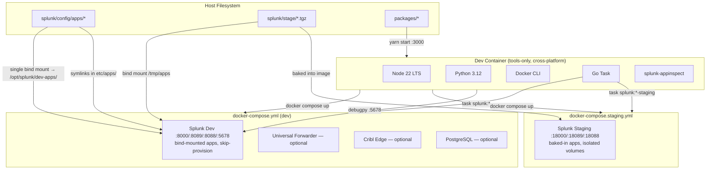
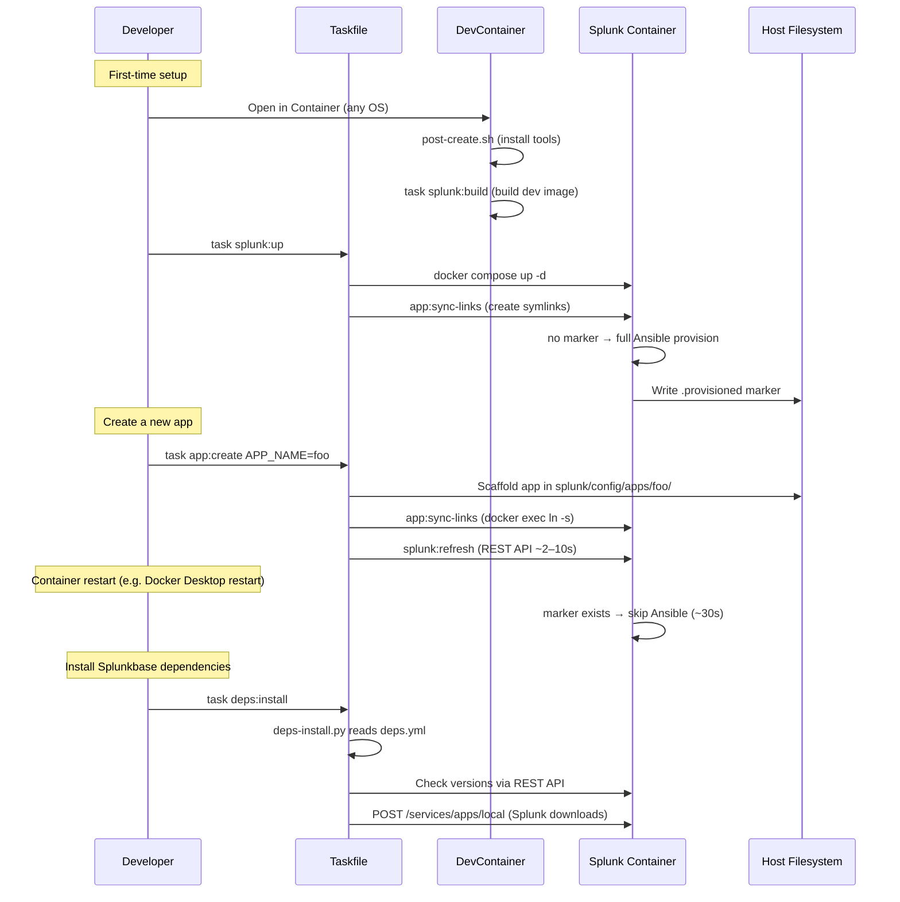
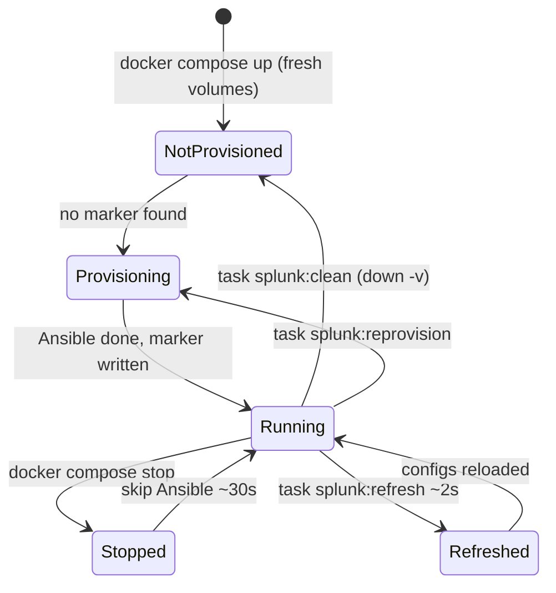

# Design: Splunk Devcontainer Template

## Tech Stack

- **Devcontainer base**: `mcr.microsoft.com/devcontainers/base:ubuntu-24.04`
- **Devcontainer features**: `docker-outside-of-docker:1`, `node:1` (v22), `python:1` (v3.12), `go-task:1`
- **Splunk image**: `splunk/splunk:9.4.0` (official, x86-64 only) with custom multi-stage Dockerfile
- **React UI**: `@splunk/create` (webpack-based), `@splunk/dashboard-core` for Dashboard Studio embedding
- **Automation**: Go Task (`Taskfile.yml`)
- **Python linting**: ruff
- **Shell linting**: shellcheck
- **Python testing**: pytest
- **E2E testing**: `@devcontainers/cli`
- **CI/CD**: GitHub Actions, `VatsalJagani/splunk-app-action@v5`

## Directory Structure

```
.devcontainer/
  devcontainer.json              # Tools-only devcontainer (Node, Python, Docker CLI, Task)
  docker-compose.yml             # Dev Splunk (target: dev, bind mounts, port 8000)
  docker-compose.staging.yml     # Staging Splunk (target: staging, baked apps, port 18000)
  post-create.sh                 # Tool install + Splunk image build
splunk/
  Dockerfile                     # Multi-stage: base → dev / staging
  entrypoint-wrapper.sh          # Skip-provision + auto-discover /tmp/apps/*.tgz
  scripts/
    deps-install.py              # Splunkbase dependency installer (stdlib Python only)
  config/
    apps/                        # Splunk app source (bind-mounted → symlinked into etc/apps/)
      splunk-config-dev/         # Dev-mode web.conf (js_no_cache, enableWebDebug, etc.)
      <your_app>/                # Created via `task app:create APP_NAME=<your_app>`
    deps.yml                     # Splunkbase dependencies declaration
  stage/                         # Built tarballs (.tgz) — gitignored, .gitkeep tracked
packages/                        # React/JS source (monorepo via @splunk/create) — .gitkeep tracked
Taskfile.yml                     # All automation
.env                             # Secrets/config — gitignored
splunk.env.example               # Template for .env
AGENTS.md                        # Concise repo summary + windloop hint
ARCHITECTURE.md                  # Full architecture, commands, debugging docs
.vscode/launch.json              # Debug configs (Python attach, Chrome, React dev server)
tests/e2e/                       # E2E test scripts
.github/workflows/
  ci.yml                         # Push/PR: shellcheck + local AppInspect
  release.yml                    # Tag push: API AppInspect + artifact upload
```

## Architecture Overview



## Module Design

### Module 1: Custom Splunk Image + Entrypoint Wrapper

- **Purpose**: Wrap the official Splunk entrypoint to skip Ansible re-provisioning on restart — the key enabler of the fast dev loop.
- **Files**: `splunk/Dockerfile`, `splunk/entrypoint-wrapper.sh`
- **How it works**:

```
entrypoint-wrapper.sh
├── Check for marker: /opt/splunk/var/.provisioned
├── IF marker exists AND command is "start-service":
│   ├── Skip Ansible entirely
│   ├── Write healthcheck state file (so checkstate.sh passes)
│   ├── Start splunkd: /opt/splunk/bin/splunk start --accept-license
│   ├── Trap SIGTERM → splunk stop
│   └── Tail splunkd_stderr.log
├── ELSE (first run or FORCE_PROVISION=true):
│   ├── Delegate to stock /sbin/entrypoint.sh
│   └── On success, write marker (as splunk user via su)
└── END
```

- **Marker file**: `/opt/splunk/var/.provisioned` — in `splunk-var` named volume, persists across container recreations, cleared by `docker compose down -v`.
- **Force re-provision**: `FORCE_PROVISION=true` env var or `task splunk:reprovision` (removes marker, restarts).

**Dockerfile** (minimal wrapper):
```dockerfile
ARG SPLUNK_VERSION=9.4.0
FROM splunk/splunk:${SPLUNK_VERSION}

USER root
RUN microdnf install -y acl && microdnf clean all

COPY entrypoint-wrapper.sh /sbin/entrypoint-wrapper.sh
RUN chmod 755 /sbin/entrypoint-wrapper.sh

USER ansible
ENTRYPOINT ["/sbin/entrypoint-wrapper.sh"]
CMD ["start-service"]
```

### Module 2: Docker Compose Services

- **Purpose**: Define runtime services independently from the devcontainer
- **File**: `.devcontainer/docker-compose.yml`
- **Interface**: `task splunk:up`, `task splunk:down`, `task splunk:logs`, etc.
- **Key design decisions**:
  - `platform: linux/amd64` — Splunk image is x86-64 only; required for Apple Silicon Macs
  - Single bind mount: `splunk/config/apps/` → `/opt/splunk/dev-apps/`
  - Per-app symlinks in `/opt/splunk/etc/apps/` created by `app:sync-links`
  - Named volumes: `splunk-var` (indexed data + provisioning marker), `splunk-etc` (Splunk config + installed apps)
  - Both volumes persist across container recreation — enables skip-provision on `docker compose up`
  - Optional sidecars (UF, Cribl Edge, PostgreSQL) commented out by default

### Module 3: App Symlink Manager

- **Purpose**: Create and maintain symlinks from `/opt/splunk/etc/apps/<app>` → `/opt/splunk/dev-apps/<app>`
- **File**: `Taskfile.yml` (`app:sync-links` task)
- **How it works**:
  1. Scan `/opt/splunk/dev-apps/` inside the running container for directories
  2. For each directory, create symlink at `/opt/splunk/etc/apps/<app>` (skip if exists)
  3. Remove stale symlinks (pointing to deleted app directories)
  4. Runs via `docker exec --user root` (splunk-etc volume owned by splunk user)
  5. Runs automatically after `splunk:up` and after `app:create`
- **Why symlinks**: Per-app bind mounts require container recreation for each new app. Symlinks need only `docker exec ln -s` + `splunk:refresh` (~2–10s). Validated by Splunk's own `@splunk/create` tooling (`yarn run link:app`).

### Module 4: Dependency Manager

- **Purpose**: Idempotent installation of Splunkbase app dependencies
- **Files**: `splunk/config/deps.yml`, `splunk/scripts/deps-install.py`
- **Interface**: `task deps:install`
- **How it works**:
  1. Parse `deps.yml` (regex-based, stdlib only — no pyyaml)
  2. For each dependency: check if installed at correct version via REST API (`/services/apps/local/<name>`)
  3. Splunkbase deps: authenticate via `api/account:login`, POST to `/services/apps/local` (Splunk downloads itself)
  4. URL deps: download tarball, install via `splunk install app`
  5. Skip already-installed apps at correct version (idempotent)

### Module 5: Devcontainer Configuration

- **Purpose**: Cross-platform uniform tooling environment via VS Code devcontainer
- **Files**: `.devcontainer/devcontainer.json`, `.devcontainer/post-create.sh`
- **Interface**: "Reopen in Container" in VS Code
- **Key decisions**:
  - Ubuntu 24.04 base — consistent Linux environment on any host OS
  - Features: docker-outside-of-docker (talks to host Docker daemon), node 22, python 3.12, go-task
  - `post-create.sh`: installs splunk-appinspect, ruff, pytest; builds Splunk dev image
  - No `shutdownAction: stopCompose` — compose lifecycle is independent of devcontainer
  - Ports forwarded: 8000 (Splunk Web), 8089 (REST), 8088 (HEC), 3000 (React dev server)

### Module 6: Taskfile

- **Purpose**: Central automation for all operations
- **File**: `Taskfile.yml`
- **Namespaces**:
  - `splunk:*` — compose lifecycle: `build`, `up`, `down`, `clean`, `refresh`, `restartd`, `restart`, `reprovision`, `status`, `logs`, `build-staging`, `up-staging`, `down-staging`, `clean-staging`, `logs-staging`
  - `app:*` — `create`, `package`, `provision`, `sync-links`
  - `react:*` — `create`, `add-page`, `link`, `start`, `build`, `package`
  - `deps:*` — `install`
  - `python:*` — `lint`, `format`, `test`
  - `test:*` — `e2e`, `all`

### Module 7: Staging Compose

- **Purpose**: Self-contained staging environment running alongside dev on different ports
- **File**: `.devcontainer/docker-compose.staging.yml`
- **Interface**: `task splunk:up-staging`, `task splunk:down-staging`, `task splunk:clean-staging`, `task splunk:logs-staging`
- **Key design decisions**:
  - Targets `staging` Dockerfile stage (bakes in tarballs from `splunk/stage/`)
  - Uses `entrypoint-wrapper.sh` (auto-discovers `/tmp/apps/*.tgz` for `SPLUNK_APPS_URL`)
  - Ports: 18000 (Web), 18089 (REST), 18088 (HEC)
  - Own named volumes (`splunk-staging-var`, `splunk-staging-etc`) — fully isolated from dev
  - No bind mounts — apps baked into image

### Module 8: Debugging Support

- **Purpose**: Enable Python and React/JS debugging from VS Code into the Splunk container
- **Files**: `.vscode/launch.json`, `splunk/config/deps.yml`, `.devcontainer/docker-compose.yml`, `splunk/config/apps/splunk-config-dev/`
- **Python debugging**: SA-VSCode add-on → `enable_debugging()` → debugpy on port 5678 → VS Code attach
- **React/JS debugging**: webpack watch updates `stage/` live (symlinked into Splunk via `react:link`); source maps in Splunk Web for debugging
- **splunk-config-dev**: Sets `web.conf` debug options (`js_no_cache`, `minify_js=false`, `enableWebDebug=true`)
- **Launch configs**: Python attach, Chrome Splunk Web (:8000), Chrome React dev (:3000), Chrome Staging (:18000)

## Data Flow



## State Management



## Data Models

### deps.yml

```yaml
dependencies:
  - name: Splunk_SA_Scientific_Python_linux_x86_64
    splunkbase_id: 2882
    version: "4.2.3"
  - name: Splunk_ML_Toolkit
    splunkbase_id: 2890
    version: "5.6.1"
  # - name: SA-VSCode
  #   splunkbase_id: 4801
  #   version: "0.1.3"
  # - name: custom_app
  #   url: "https://example.com/custom_app-1.0.tgz"
```

## Error Handling Strategy

- **Entrypoint wrapper**: If splunkd fails in skip-provision mode, log the error and suggest `task splunk:reprovision`
- **Dependency install**: If a Splunkbase download fails (auth, network), log clearly and continue with remaining deps
- **App symlink sync**: If `splunk/config/apps/` is empty, `app:sync-links` is a no-op. If Splunk is not running, defers to next `splunk:up`.
- **Tarball packaging**: Validate app directory exists before packaging; clear error if not
- **Missing `.env`**: Taskfile falls back to defaults; `post-create.sh` creates it from `splunk.env.example`

## Testing Strategy

- **Static validation**: shellcheck, JSON syntax, `docker compose config`, `task --list`
- **E2E tests**: `@devcontainers/cli` build → up → exec smoke tests (tools, compose, taskfile)
- **Lifecycle tests**: 6 focused scripts with shared helpers (`tests/e2e/helpers.sh`)
- **E2E command**: `task test:e2e`
- **Lint command**: `task python:lint` (ruff), shellcheck in CI

## Constraints

- Must use the official `splunk/splunk` Docker image as base (not a fork)
- Dockerfile is minimal: FROM official image, install acl, COPY wrapper, override ENTRYPOINT
- `platform: linux/amd64` required — Splunk image is x86-64 only (Apple Silicon uses emulation)
- Devcontainer must NOT run Splunk inside it
- Compose services start/stop independently from the devcontainer lifecycle
- No Yeoman (`yo`), no `splunk-packaging-toolkit` (slim) — both deprecated
- `@splunk/create` used via `npx`, not installed globally
- Ephemeral directories (`splunk/stage/`, `packages/`) tracked via `.gitkeep`
- User-created apps under `splunk/config/apps/` are gitignored (only `splunk-config-dev/` ships with the template)

## Correctness Properties

### Property 1: Skip-provision correctness
- **Statement**: *For any* Splunk container with a `.provisioned` marker in `splunk-var`, when the container starts with `start-service`, then Ansible is NOT executed and splunkd starts directly in ≤40s.
- **Validates**: Requirement 2.1, 2.4, NF 2
- **Example**: `docker compose restart splunk` completes in <40s on second run
- **Test approach**: Check container logs for absence of "ansible-playbook" and presence of "Skipping Ansible provisioning"

### Property 2: First-run provisioning
- **Statement**: *For any* Splunk container without a `.provisioned` marker, when the container starts, then full Ansible provisioning runs and the marker is created.
- **Validates**: Requirement 2.2
- **Test approach**: `docker compose down -v && docker compose up` — check logs for Ansible execution and marker existence

### Property 3: Force re-provision
- **Statement**: When `task splunk:reprovision` is run, the marker is removed and full Ansible provisioning runs on next start.
- **Validates**: Requirement 2.3
- **Test approach**: Reprovision, verify marker removed then re-created, check logs for Ansible execution

### Property 4: Multi-app symlink creation
- **Statement**: *For any* set of directories in `splunk/config/apps/`, `task app:sync-links` creates corresponding symlinks in `/opt/splunk/etc/apps/`. Existing symlinks are preserved; stale ones are removed.
- **Validates**: Requirement 3.2, 4.1, 4.6
- **Test approach**: Create app dirs, run `app:sync-links`, verify symlinks via `docker exec ls -la`

### Property 5: Idempotent dependency install
- **Statement**: Running `task deps:install` twice with the same `deps.yml` produces no changes on the second run.
- **Validates**: Requirement 5.2
- **Test approach**: Run install, capture output, run again, verify "already installed" messages

### Property 6: Devcontainer tools-only
- **Statement**: The devcontainer contains no Splunk binaries, uses modern VS Code config schema, and provides a fully configured dev environment identical across macOS, Windows, and Linux hosts.
- **Validates**: Requirement 1.1, 1.2, 1.3, 1.6, NF 4
- **Test approach**: Verify `which splunk` returns nothing inside devcontainer; verify tool versions

### Property 7: App live-reload via symlinked bind mount
- **Statement**: *For any* file change in a bind-mounted app directory on the host, the change is visible inside the Splunk container at `/opt/splunk/etc/apps/<app>/` without restarting or re-packaging.
- **Validates**: Requirement 3.2, 4.1
- **Test approach**: Write a file to `splunk/config/apps/TestApp/test.txt`, verify it exists at `/opt/splunk/etc/apps/TestApp/test.txt` inside the container

### Property 8: Staging compose isolation
- **Statement**: *For any* staging container started via `docker-compose.staging.yml`, it uses ports 18000/18089/18088, separate volumes (`splunk-staging-var`, `splunk-staging-etc`), a separate container name (`splunk-staging`), and the `staging` Dockerfile target.
- **Validates**: Requirement 9.1, 9.2
- **Test approach**: Validate `docker compose config` for both files; verify port mappings, volume names, container names, and build target are distinct

### Property 9: Debug configurations complete
- **Statement**: The dev compose file exposes port 5678 for debugpy, `launch.json` contains four configurations (Python attach, Chrome Splunk Web, Chrome React dev, Chrome Staging), and `splunk-config-dev` sets web.conf debug options.
- **Validates**: Requirement 8.1, 8.2, 8.3
- **Test approach**: Validate port 5678 in compose config; parse `launch.json` for all four configs

### Property 10: E2E devcontainer build succeeds
- **Statement**: *For any* clean checkout, `devcontainer build` and `devcontainer up` complete successfully and `post-create.sh` exits 0 within the time budget.
- **Validates**: Requirement 10.1, NF 1
- **Test approach**: Run devcontainer CLI build and up; assert exit codes are 0

### Property 11: All tools and namespaces available
- **Statement**: *For any* running devcontainer, all expected tools (node, python3, docker, task, ruff) are on PATH, `task --list` shows all namespaces, and `docker compose config` validates for both compose files.
- **Validates**: Requirement 1.1, 1.4, 7.1, 10.1
- **Test approach**: `devcontainer exec` each tool check; parse outputs for expected patterns

### Property 12: Skip-provision and reprovision E2E
- **Statement**: Restarting a provisioned container recovers in ≤60s without Ansible. After `task splunk:reprovision`, full Ansible runs and the marker is re-created.
- **Validates**: Requirement 2.1, 2.2, 2.3, 10.4, NF 2
- **Test approach**: Restart container, time recovery, check logs. Then reprovision, verify marker lifecycle.

### Property 13: App naming consistency
- **Statement**: `APP_NAME` equals the folder name under `splunk/config/apps/`, equals `[package] id` in `app.conf`, and (for React apps) matches `packages/<APP_NAME>/`. `[ui] label` is the human-readable form.
- **Validates**: Requirement 13.1, 13.2, 13.3
- **Test approach**: Set `APP_NAME`, run `app:create`, verify folder, `app.conf` fields, and label.

### Property 14: CI/CD workflows valid and current
- **Statement**: `ci.yml` and `release.yml` use current action versions, read `APP_NAME` from `.env`, and use `splunk-app-action@v5` for AppInspect.
- **Validates**: Requirement 14.1, 14.2, 14.3, 14.4
- **Test approach**: Parse workflow YAML for action versions and `APP_NAME` sourcing; validate YAML syntax.

## Edge Cases

- **Empty `splunk/config/apps/`**: `app:sync-links` is a no-op
- **Stale symlinks**: If an app directory is deleted, `app:sync-links` removes the dangling symlink
- **Splunk container not running**: `app:create` scaffolds the app and defers symlink creation to next `splunk:up`
- **Splunkbase auth failure**: `deps:install` logs the error and continues with remaining deps
- **Docker Desktop restart**: Container restarts trigger entrypoint-wrapper; marker survives (in `splunk-var` volume)
- **Apple Silicon (ARM)**: `platform: linux/amd64` forces x86 emulation via Rosetta/QEMU

## Decisions

### Decision: Docker-outside-of-Docker vs Docker-in-Docker
**Context:** The devcontainer needs to manage Docker Compose services (Splunk).
**Options Considered:**
1. Docker-in-Docker — runs a separate Docker daemon inside the devcontainer. Pros: fully isolated. Cons: complex, slow, volume sharing is awkward.
2. Docker-outside-of-Docker — mounts the host's Docker socket. Pros: simple, fast, shares host images/volumes. Cons: devcontainer has access to host Docker daemon.
**Decision:** Docker-outside-of-Docker.
**Rationale:** Simpler setup, faster, and the security tradeoff is acceptable for a local dev template. This is the standard approach for devcontainer + compose workflows.

### Decision: Single bind mount + symlinks vs per-app bind mounts
**Context:** Apps need to be live-editable inside Splunk without container recreation.
**Options Considered:**
1. Per-app bind mounts — each app gets its own mount. Pros: direct. Cons: requires container recreation for each new app (~30s each time).
2. Single parent bind mount + symlinks — mount `splunk/config/apps/` once, symlink each app into `etc/apps/`. Pros: new apps need only `docker exec ln -s` + refresh (~2–10s). Cons: symlinks must be managed.
**Decision:** Single bind mount + symlinks.
**Rationale:** Eliminates container recreation for new apps. Pattern validated by Splunk's own `@splunk/create` tooling (`yarn run link:app`).

## Security Considerations

- `.env` is gitignored (contains `SPLUNK_PASSWORD`, Splunkbase credentials)
- Splunk admin password defaults to `admin123` for dev — acceptable for local dev only
- No secrets baked into Docker images
- `splunk.env.example` contains placeholder values only
