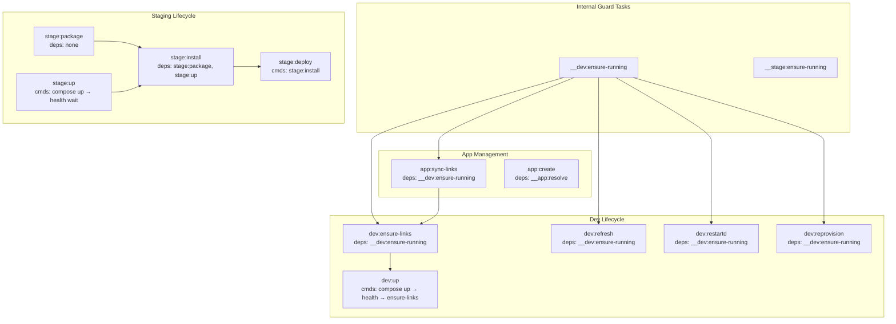

# Design: Taskfile Dependency Refactor

## Tech Stack

- **Automation**: Go Task (`Taskfile.yml`) — version 3
- **Shell**: bash (inline task scripts)
- **Testing**: E2E bash scripts in `tests/e2e/`
- **Test command**: `task test:native`

## Architecture Overview

This refactor changes the *wiring* between tasks, not the tasks themselves. The key change is moving from imperative "call task X in my cmds" to declarative "I depend on task X".



## Module Design

### Module 1: Guard Tasks

Two new internal tasks that check if a container is running.

```yaml
__dev:ensure-running:
  internal: true
  cmds:
    - |
      if ! docker ps --filter name="{{.SPLUNK_CONTAINER}}" --format '{{`{{.Names}}`}}' | grep -q "^{{.SPLUNK_CONTAINER}}$"; then
        echo "ERROR: Dev container is not running. Start with: task dev:up"
        exit 1
      fi

__stage:ensure-running:
  internal: true
  cmds:
    - |
      if ! docker ps --filter name="splunk-staging" --format '{{`{{.Names}}`}}' | grep -q "^splunk-staging$"; then
        echo "ERROR: Staging container is not running. Start with: task stage:up"
        exit 1
      fi
```

**Design decision**: These are `cmds`, not `preconditions`, because Taskfile `preconditions` use a different syntax and don't support the same shell flexibility. A simple internal task with `exit 1` on failure achieves the same effect and is more readable.

### Module 2: DRY Staging Compose Helper

Mirror the existing `__dev-compose` pattern:

```yaml
__stage-compose:
  internal: true
  cmds:
    - docker compose --env-file {{.ENV_FILE}} -f {{.COMPOSE_STAGING_FILE}} {{.COMPOSE_ARGS}}
```

All staging tasks (`stage:up`, `stage:down`, `stage:clean`, `stage:logs`) switch to using this.

### Module 3: Dev Task Dependency Wiring

Tasks that require a running dev container add `deps: [__dev:ensure-running]`:

| Task | Current | After |
|------|---------|-------|
| `dev:ensure-links` | `cmds: [app:sync-links]` | `deps: [__dev:ensure-running]`, `cmds: [app:sync-links]` |
| `dev:refresh` | no guard | `deps: [__dev:ensure-running]` |
| `dev:restartd` | no guard | `deps: [__dev:ensure-running]` |
| `dev:reprovision` | no guard | `deps: [__dev:ensure-running]` |
| `app:sync-links` | inline "is running?" check | `deps: [__dev:ensure-running]`, remove inline check |
| `react:link` | `deps: [__react:ensure-build]` | `deps: [__react:ensure-build, __dev:ensure-running]` |
| `deps:install` | Python script checks | `deps: [__dev:ensure-running]`, remove Python check |

**`dev:up` stays as `cmds`** — it's a sequential pipeline (start → wait → link). The container doesn't exist yet when `dev:up` begins, so it can't dep on `__dev:ensure-running`.

**`app:create` stays as `cmds`** for `dev:ensure-links` and `dev:refresh` — these are sequential post-scaffold steps, not preconditions.

### Module 4: Staging Lifecycle Decomposition

```yaml
stage:package:
  cmds:
    - |
      echo "Packaging all apps in {{.CONFIG_APPS_DIR}}/ ..."
      mkdir -p "{{.STAGE_DIR}}"
      for APP_DIR in {{.CONFIG_APPS_DIR}}/*/; do
        [ -d "$APP_DIR" ] || continue
        APP=$(basename "$APP_DIR")
        case "$APP" in .*) continue ;; esac
        TAR_PATH="{{.STAGE_DIR}}/${APP}.tgz"
        echo "  $APP → $TAR_PATH"
        tar -czf "$TAR_PATH" -C "{{.CONFIG_APPS_DIR}}" "$APP"
      done
      echo "All apps packaged to {{.STAGE_DIR}}/"
  desc: Package all apps from splunk/config/apps/ into splunk/stage/

stage:up:
  cmds:
    - task: __stage-compose
      vars: { COMPOSE_ARGS: 'up -d' }
    - |
      echo "Waiting for staging Splunk to be ready..."
      for i in $(seq 1 36); do
        STATUS=$(docker exec splunk-staging bash -lc \
          "curl -sk -o /dev/null -w '%{http_code}' https://localhost:8089/services/server/health -u admin:\$SPLUNK_PASSWORD" 2>/dev/null || echo 000)
        [ "$STATUS" = "200" ] && echo "Staging Splunk ready." && break
        [ "$i" = "36" ] && echo "Staging did not become ready in time." && exit 1
        sleep 5
      done
  desc: Start staging Splunk and wait for healthy

stage:install:
  deps: [stage:package, stage:up]
  cmds:
    - |
      echo "Installing apps from {{.STAGE_DIR}}/ into staging..."
      INSTALLED=0; SKIPPED=0
      for TGZ in {{.STAGE_DIR}}/*.tgz; do
        [ -f "$TGZ" ] || continue
        APP=$(basename "$TGZ" .tgz)
        echo "  Installing $APP..."
        docker exec splunk-staging bash -lc \
          "{{.SPLUNK_BIN}} install app /tmp/apps/${APP}.tgz -update true -auth admin:\$SPLUNK_PASSWORD" \
          2>&1 && INSTALLED=$((INSTALLED + 1)) || SKIPPED=$((SKIPPED + 1))
      done
      echo "Install complete: $INSTALLED installed, $SKIPPED failed"
  desc: Install all tgz from splunk/stage/ into running staging (deps auto-package + start)

stage:deploy:
  cmds:
    - task: stage:install
  desc: Package all apps, start staging, and install (convenience alias)
```

**Key dependency chain**:
```
stage:deploy
  └── cmds: stage:install
        └── deps: [stage:package, stage:up]  (run in parallel)
              ├── stage:package: tar all apps
              └── stage:up: compose up + health wait
```

### Module 6: APP_NAME Guard (eliminate .task/app-env)

Replace `__app:resolve` (which writes `.task/app-env` to disk) with a pure guard:

```yaml
__ensure-app-name:
  internal: true
  cmds:
    - |
      if [ -z "{{.APP_NAME}}" ]; then
        echo "ERROR: APP_NAME is required (pass APP_NAME=x or set in .env)"
        exit 1
      fi
```

**How APP_NAME flows** (no file needed):
1. `dotenv: ['.env']` loads `APP_NAME` as an env var available in all shell blocks as `$APP_NAME`
2. `task app:create APP_NAME=foo` sets `{{.APP_NAME}}` as a Taskfile variable
3. Taskfile variable `{{.APP_NAME}}` takes precedence over env var `$APP_NAME`
4. Tasks use `{{.APP_NAME}}` in their `cmds` — no `. .task/app-env` sourcing needed

**What changes**:

| Task | Current | After |
|------|---------|-------|
| `__app:resolve` | Resolves + writes `.task/app-env` | **Removed** — replaced by `__ensure-app-name` |
| `app:create` | `deps: [__app:resolve]`, `. .task/app-env` | `deps: [__ensure-app-name]`, uses `{{.APP_NAME}}` |
| `app:package` | `deps: [__app:resolve]`, `. .task/app-env` | `deps: [__ensure-app-name]`, uses `{{.APP_NAME}}` |
| `__react:resolve` | Reads APP_NAME + computes REACT_APP_PATH, writes `.task/react-env` | Keeps temp file for REACT_APP_PATH (computed value), but uses `{{.APP_NAME}}` for the name portion |
| `.task/` directory | Created by resolve tasks | No longer created by app tasks; React may still use it |

### Module 7: Cleanup — Remove Redundant Checks

| Location | Current | After |
|----------|---------|-------|
| `app:sync-links` | Inline `docker ps` check + graceful exit | Remove — `__dev:ensure-running` dep handles it |
| `deps-install.py` | `find_container()` check + error message | Remove container check — `__dev:ensure-running` dep handles it |
| `dev:up` health timeout | Suggests `task dev:ensure-links` | Keep as-is (different context — container is starting) |
| `__app:resolve` | Writes `.task/app-env` | Remove entirely — replaced by `__ensure-app-name` |
| `app:create`, `app:package` | `. .task/app-env` sourcing | Use `{{.APP_NAME}}` directly |

## Testing Strategy

- **E2E tests**: All 6 existing suites must pass (`task test:native`)
- **Staging test**: Update `test-staging.sh` to exercise `stage:deploy` (which now triggers the full chain)
- **Guard test**: Existing tests implicitly validate guards — boot suite starts Splunk first, so guards pass. A direct guard test (run `dev:refresh` without Splunk) would be nice but is out of scope for this spec.
- **Test command**: `task test:native`

## Correctness Properties

### Property 1: Guard tasks fail fast

- **Statement**: *For any* task with `deps: [__dev:ensure-running]` or `deps: [__stage:ensure-running]`, when the respective container is NOT running, then the task SHALL fail immediately with a clear error message before executing any `cmds`.
- **Validates**: Requirement 1.1, 1.2, 1.3
- **Test approach**: Stop dev container, run `dev:refresh`, verify error message and non-zero exit.

### Property 2: Guard tasks pass silently

- **Statement**: *For any* task with `deps: [__dev:ensure-running]`, when the dev container IS running, then the guard produces no output and `cmds` execute normally.
- **Validates**: Requirement 1.3
- **Test approach**: Start dev container, run `dev:refresh`, verify no guard output in stdout.

### Property 3: Staging dependency chain

- **Statement**: When `stage:deploy` is run, then `stage:package` and `stage:up` SHALL both complete (in parallel) before `stage:install` runs. Apps SHALL be installed via CLI into the running staging container. Re-running install on already-installed apps SHALL succeed (idempotent).
- **Validates**: Requirement 3.1, 3.2, 3.3, 3.4, 3.5
- **Test approach**: Run `stage:deploy` from clean state, verify tgz files exist, staging is healthy, and apps are installed via REST API.

### Property 4: Backward compatibility

- **Statement**: *For any* user-facing task, the name, arguments, and observable behavior SHALL remain unchanged after this refactor.
- **Validates**: Requirement 6.1, 6.2
- **Test approach**: All 6 E2E suites pass without modification (except staging test updates for new task structure).

### Property 5: No .task/app-env state file

- **Statement**: After the refactor, no `app:*` task SHALL write to `.task/app-env`. `APP_NAME` SHALL be resolved via Taskfile variable precedence (CLI arg > dotenv > empty).
- **Validates**: Requirement 7.1, 7.2, 7.4
- **Test approach**: Run `app:create APP_NAME=foo`, verify `.task/app-env` does not exist. Run `app:package APP_NAME=foo`, same check.

### Property 6: DRY staging compose

- **Statement**: All staging compose commands SHALL use `__stage-compose` with `COMPOSE_ARGS`, and no staging task SHALL contain inline `docker compose --env-file ... -f ...` commands.
- **Validates**: Requirement 4.1, 4.2
- **Test approach**: Grep Taskfile for inline staging compose commands — should find none outside `__stage-compose`.

## Edge Cases

- **No apps in `splunk/config/apps/`**: `stage:package` is a no-op (loop finds nothing), `stage:install` finds no tgz files — both succeed silently.
- **Staging already running**: `stage:up` runs `docker compose up -d` which is idempotent. Health check passes immediately.
- **tgz already installed in staging**: `splunk install app -update true` handles re-install gracefully.
- **`dev:up` called when container is already running**: `docker compose up -d` is idempotent, health check passes quickly, `ensure-links` re-syncs.

## Decisions

### Decision: Guard tasks vs Taskfile `preconditions`

**Context:** Need to check if a container is running before executing a task.
**Options:**
1. Taskfile `preconditions` — built-in, but limited to `sh` one-liners and `msg` strings.
2. Internal guard tasks in `deps` — full bash, reusable, composable with other deps.
**Decision:** Internal guard tasks.
**Rationale:** More flexible, can be combined with other deps (e.g. `deps: [__dev:ensure-running, __react:resolve]`), and the pattern is already established with `__app:resolve` and `__react:resolve`.

### Decision: APP_NAME via Taskfile vars vs file-based state

**Context:** Tasks need access to APP_NAME. Current approach writes it to `.task/app-env` on disk.
**Options:**
1. File-based state (`.task/app-env`) — dep writes file, cmds source it. Works but leaks state to disk.
2. Taskfile variable precedence — `dotenv` loads `.env`, CLI `APP_NAME=x` overrides. No file needed.
**Decision:** Taskfile variable precedence.
**Rationale:** `dotenv: ['.env']` already loads APP_NAME. CLI args override via Taskfile var precedence. A guard task validates it's set. No disk state needed for a simple string passthrough.

### Decision: `stage:deploy` as alias vs direct implementation

**Context:** `stage:deploy` could either contain all logic or delegate to `stage:install`.
**Options:**
1. `stage:deploy` contains all logic — simpler but monolithic.
2. `stage:deploy` delegates to `stage:install` — composable, each step independently runnable.
**Decision:** Delegate to `stage:install`.
**Rationale:** Users can run `stage:package`, `stage:up`, or `stage:install` independently. `stage:deploy` is just the "do everything" convenience.
