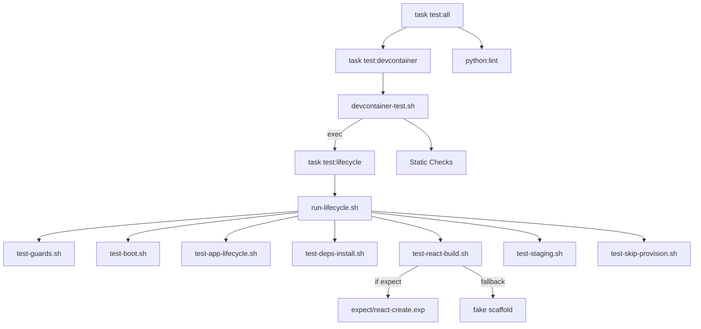
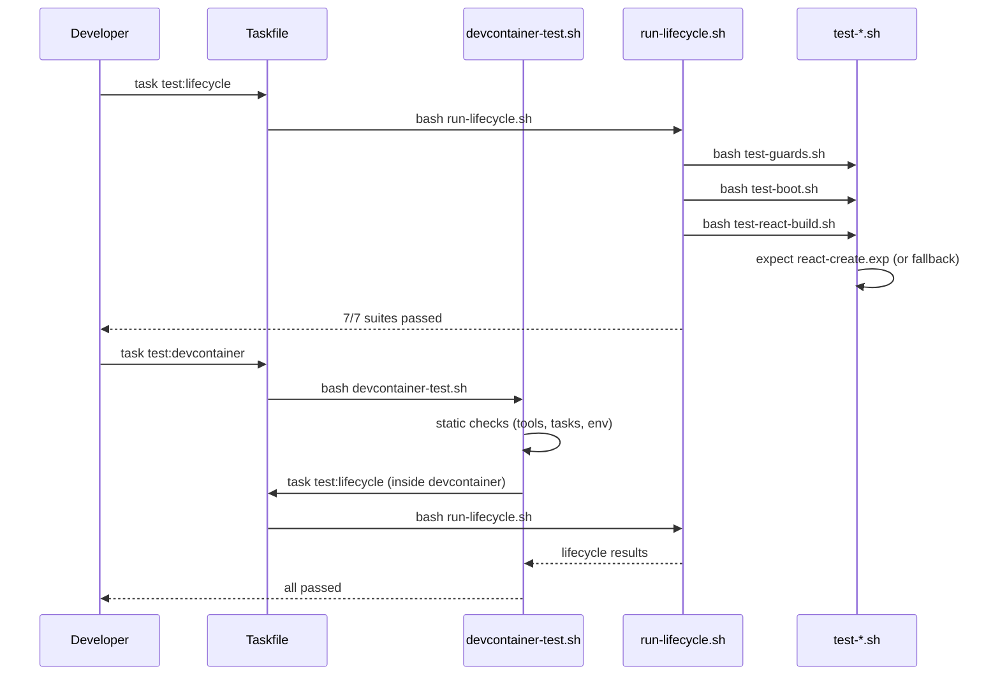

# Design: Test Improvements

## Tech Stack

- **Shell**: Bash (test scripts)
- **Expect**: TCL-based `expect` for interactive automation
- **Testing**: Custom bash test framework (`helpers.sh` — pass/fail/results)
- **Devcontainer CLI**: `@devcontainers/cli` for devcontainer build/up/exec
- **Linter**: ShellCheck (optional, not enforced)

## Directory Structure

```
tests/e2e/
  helpers.sh                  # Shared test helpers (pass/fail/results/check_app_rest)
  run-lifecycle.sh            # Lifecycle test runner (7 suites)
  devcontainer-test.sh        # Devcontainer static checks + calls run-lifecycle.sh
  test-guards.sh              # Guard failure tests
  test-boot.sh                # Splunk boot + health
  test-app-lifecycle.sh       # app:create, symlinks, package
  test-deps-install.sh        # deps:install idempotency
  test-react-build.sh         # react:create (expect) + build + package
  test-staging.sh             # stage:deploy pipeline
  test-skip-provision.sh      # Container restart skips Ansible
  expect/                     # Expect scripts for interactive tasks
    react-create.exp          # Automates npx @splunk/create wizard
```

## Architecture Overview



## Module Design

### Module 1: Taskfile Test Entry Points

- **Purpose**: Rename and unify test tasks
- **Changes**:
  - `test:native` → `test:lifecycle` (runs `run-lifecycle.sh`)
  - `test:e2e` → `test:devcontainer` (runs `devcontainer-test.sh`)
  - `test:all` → `python:lint` + `test:devcontainer`
  - Remove old task names entirely (clean break)
- **Requirements**: R1

### Module 2: Devcontainer Static Checks

- **Purpose**: Revise `devcontainer-test.sh` to verify current task structure
- **Changes**:
  - Update task existence checks: add `stage:package`, `stage:install`, `stage:deploy`, `test:lifecycle`
  - Add guard task checks via `task --list-all`: `__ensure-image`, `__dev:ensure-running`, `__stage:ensure-running`, `__ensure-app-name`, `__wait-healthy`
  - Remove stale references (`test:native`, `app:provision`, any `splunk:*` names)
  - Change lifecycle invocation from `bash run-lifecycle.sh` to `task test:lifecycle` (same code path as host)
- **Requirements**: R2

### Module 3: Expect Script for react:create

- **Purpose**: Automate the `npx @splunk/create` interactive wizard
- **File**: `tests/e2e/expect/react-create.exp`
- **Interface**:
  ```
  expect tests/e2e/expect/react-create.exp <app_name>
  ```
- **Known prompts** (from `@splunk/create` npm docs):
  1. `What do you want to name your Splunk app?` → text input (app name)
  2. `What do you want to name your new page?` → text input (page name)
  3. `What type of page would you like to...` → arrow-key selection (options include: simple page, dashboard page — select with ↑/↓ + Enter)
- **Behavior**:
  1. Spawns `task react:create`
  2. Responds to each prompt using loose pattern matching (`*name your Splunk app*`, `*name your new page*`, `*type of page*`)
  3. Uses generous timeouts (60s per prompt) to handle npm download delays
  4. Waits for completion (initial build via yarn)
  5. Exits with 0 on success, 1 on timeout/failure
- **Implementation note**: Run `npx @splunk/create` manually once to confirm exact prompt text and selection options before writing the final expect script. The page type selection may require arrow-key navigation + enter.
- **Fallback**: `test-react-build.sh` checks `command -v expect`. If absent, uses current fake scaffold with a warning.
- **Requirements**: R3

### Module 4: Revised test-react-build.sh

- **Purpose**: Use real `react:create` flow when expect is available
- **Changes**:
  - If `expect` available: call `react-create.exp` → verify directory, `.env` sync, `stage/` exists → `react:link` → verify symlink → `react:build` → `react:package` → tgz validation
  - If `expect` unavailable: current fake scaffold (with warning) → `react:build` → `react:package`
- **Requirements**: R3

### Module 5: Devcontainer expect Installation

- **Purpose**: Make `expect` available in the devcontainer
- **Method**: Add to `postCreateCommand` or devcontainer features. The base image is `mcr.microsoft.com/devcontainers/base:ubuntu-24.04`, so `apt-get install -y expect` is trivial (~1MB).
- **File**: `.devcontainer/post-create.sh` — add `sudo apt-get install -y expect` (idempotent via apt)
- **Requirements**: R4

## Data Flow



## Error Handling Strategy

- **expect not found**: Fallback to fake scaffold with `echo "WARNING: expect not available, using fake scaffold"`. Tests still pass.
- **react:create wizard changes prompts**: expect script uses generous timeouts (30s per prompt) and pattern matching. If prompts change, expect times out and test fails with clear error.
- **Devcontainer build fails**: `devcontainer-test.sh` exits immediately with FATAL message (existing behavior).

## Testing Strategy

- **Property tests**: Guard failure messages, task existence checks — inline in test scripts
- **E2E tests**: The lifecycle suites ARE the E2E tests
- **Test command**: `task test:lifecycle` (host) or `task test:devcontainer` (full)
- **Lint command**: `task python:lint`

## Correctness Properties

### Property 1: Test path equivalence
- **Statement**: *For any* lifecycle test suite, when run via `task test:lifecycle` on the host or via `task test:devcontainer` inside the devcontainer, then the same test code executes and produces the same pass/fail results.
- **Validates**: R1.1, R1.2
- **Example**: `test-boot.sh` runs identically on Mac host and inside devcontainer
- **Test approach**: Run `task test:lifecycle` on host, then `task test:devcontainer` — both should report same suite results.

### Property 2: Static check coverage
- **Statement**: *For any* task added by the dependency refactor, when `devcontainer-test.sh` runs static checks, then the task is verified to exist.
- **Validates**: R2.1, R2.2
- **Example**: `stage:package`, `__ensure-image` both checked
- **Test approach**: Run `task test:devcontainer` and verify static check output includes new tasks.

### Property 3: Expect fallback
- **Statement**: *For any* host where `expect` is not installed, when `test-react-build.sh` runs, then it falls back to fake scaffold and all react tests still pass.
- **Validates**: R3.3
- **Example**: Mac without expect installed → fake scaffold → react:build + react:package pass
- **Test approach**: Temporarily rename `expect` binary, run `task test:lifecycle`, verify react-build suite passes with warning.

### Property 4: Real react:create flow
- **Statement**: *For any* host where `expect` is installed, when `test-react-build.sh` runs, then it exercises the real `react:create` wizard and verifies the full chain (scaffold → .env sync → initial build → react:link → symlink).
- **Validates**: R3.1, R3.2, R3.4
- **Example**: `expect react-create.exp test_react_app` → directory exists, `.env` has `APP_NAME=test_react_app`, `stage/` built
- **Test approach**: Run `task test:lifecycle` with expect installed, verify react-build suite output includes "react:create" (not "fake scaffold").

## Edge Cases

- **@splunk/create prompt changes**: expect script should use loose pattern matching (`*app*` not exact strings). Add timeout with clear error.
- **yarn/npm not installed**: `react:create` will fail before expect gets involved. Test catches this as a task failure.
- **Concurrent test runs**: Tests use fixed container names (`splunk-dev`, `splunk-staging`). Concurrent runs will conflict. Out of scope — document as limitation.

## Decisions

### Decision: expect vs unbuffer vs node-pty
**Context:** Need to automate interactive CLI prompts in `react:create`.
**Options Considered:**
1. `expect` — Pros: battle-tested, available via apt, simple TCL scripts / Cons: TCL syntax, extra dependency
2. `unbuffer` (part of expect package) — Pros: simpler / Cons: can't respond to prompts, only disables buffering
3. `node-pty` / custom Node script — Pros: same runtime as React tooling / Cons: heavy dependency, complex
**Decision:** `expect`
**Rationale:** Lightweight (~1MB), purpose-built for this, available on all Linux distros. TCL syntax is simple enough for a single script.

### Decision: Fallback when expect missing
**Context:** Mac hosts may not have expect installed by default.
**Options Considered:**
1. Require expect (fail if missing)
2. Fallback to fake scaffold with warning
**Decision:** Fallback with warning
**Rationale:** Don't break existing workflows. The fake scaffold tests react:build and react:package correctly — expect adds coverage of react:create wizard but isn't critical.

### Decision: Install expect via post-create.sh
**Context:** Need expect in devcontainer.
**Options Considered:**
1. Custom Dockerfile layer
2. Devcontainer feature
3. `post-create.sh` apt-get
**Decision:** `post-create.sh`
**Rationale:** Simplest, already have a post-create script, apt install is idempotent and fast (~1s). No need for a custom feature or Dockerfile change.
